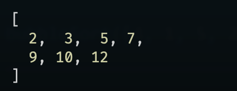
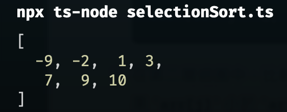

# Sorting Algorithms Part 1

In this section, we will be looking at the following sorting algorithms which may not have the best performance but in some cases, they are still useful.

<details>
  <summary> Bubble Sort </summary>
  
  # Bubble Sort

- It compares adjacent elements and swaps them if they are not in the intended order.
- "Bubble Sort" is not a good sorting algorithm, in modern programming languages its primarily used for educational purposes.

```text
Original order is : [5, 2, 6, 1, 4]

First round: Push the smallest number 1 to the left.
- 1    5 2 6 4

Second round: Push the second smallest number 2 to the left.
- 1 2   5 6 4

Third round: Push the third smallest number 4 to the left.
- 1 2 4   5 6

Fourth round: Push the fourth smallest number 5 to the left.
- 1 2 4 5   6

Fifth round: Completed sorting.
- 1 2 4 5 6
```

## Pseduo Code

```text
bubbleSort(a):
  for i from 0 to a.length - 2(inclusive):
    for j from a.length - 1 to i + 1(inclusive):
      if a[j] < a[j - 1]:
        exchange a[j] with a[j - 1]
```

The outer loop runs from index 0 to the length of the array - 2, i.e. [5, 2, 6, 1, 4], the outer loop will run from **index 0 (5) to index 3 (1)**, since we don't need to execute the last one, therefore we need to subtract 2 from the length of the array.

The inner loop runs from the last index of the array (j), and it has to compare with the previous index (array - 1) all the way to the index of i + 1.

## Example

```ts
// bubbleSort.ts
const bubbleSort = (arr: number[]) => {
  for (let i = 0; i <= arr.length - 2; i++) {
    for (let j = arr.length - 1; j >= i + 1; j--) {
      if (arr[j] < arr[j - 1]) {
        // swap
        let temp = arr[j];
        arr[j] = arr[j - 1];
        arr[j - 1] = temp;
      }
    }
  }
  console.log(arr);
};

bubbleSort([2, 9, 12, 3, 5, 7, 10]);
```

Result:



Let's give a large array and see how long it takes to sort it.

```ts
const bubbleSort = (arr: number[]) => {
  let step = 0;
  for (let i = 0; i <= arr.length - 2; i++) {
    for (let j = arr.length - 1; j >= i + 1; j--) {
      if (arr[j] < arr[j - 1]) {
        // swap
        let temp = arr[j];
        arr[j] = arr[j - 1];
        arr[j - 1] = temp;
        step++;
      }
    }
  }
  console.log(`It took ${step} to complete this bubble sort.`);
  console.log(arr);
};

// Make a large array
let largeArr: number[] = [];

for (let i = 0; i < 100; i++) {
  largeArr.push(Math.floor(Math.random() * 100));
}

bubbleSort(largeArr);
```

Result:


## Big O of Bubble Sort

- Worst case: O(n^2)
  - From smallest to largest or from largest to smallest and the numbers are totally random.

```text
[n, n-1, n-2,...4, 3, 2, 1]
[1, n, n-1, n-2,...4, 3, 2]
[1, 2, n, n-1, n-2,...4, 3]
[1, 2, 3, n, n-1, n-2,...4]
[1, 2, 3, 4,...,n-2, n-1, n]
```

From example above, we know that we need to take `(n-1) + (n-2) + (n-3) +...+(n-n)`, which is `n(n-1)/2`, therefore the worst case is `O(n^2)`.

- Best case: O(n)
  - If the array is already or almost sorted **from smallest to largest**, then we only need to compare each element once.

```ts
const bubbleSort = (arr: number[]) => {
  for (let i = 0; i <= arr.length - 2; i++) {
    let isSwapped = false;
    for (let j = arr.length - 1; j >= i + 1; j--) {
      if (arr[j] < arr[j - 1]) {
        // swap
        let temp = arr[j];
        arr[j] = arr[j - 1];
        arr[j - 1] = temp;
        isSwapped = true;
      }
    }
    // If there is no swap, then break the loop
    if (!isSwapped) {
      break;
    }
  }
  console.log(arr);
};

bubbleSort([2, 5, 7, 9, 10, 12, 3]);
```

Since this is a nearly sorted array, we only need to compare each element once (loop at least once), therefore the best case is `O(n)`.

> Resource
> [Javascript Freecodecamp Algorithm #31: Implement Bubble Sort](https://www.youtube.com/watch?v=IAeLoGzU4RE)

</details>

<details>
  <summary>Insertion Sort<summary>

# What is Insertion Sort?

- It has the same performance as bubble sort, but it is more efficient than bubble sort, in most of the cases, it's complexity is `O(n^2)`.
- The priciple of insertion sort is keep inserting a new value into a sorted array until it is inserted to the correct postion so the result would be sorted.

## Pseduo Code

```text
insertionSort(arr):
  for i from index 1 to arr.length - 1:
    key = arr[j]
    // Insert arr[i] into the sorted sequence arr[0...i-1]
    i = j - 1
    while i >= 0 and arr[i] > key:
      arr[i + 1] = arr[i]
      i -= 1
    arr[i + 1] = key
```

- First for loop starts from index 1 to the end of the array, when it starts from index 1? Because we assume that the first element (index 0) is already sorted, so we need to check from index 1.

## Example

```ts
// insertion.ts
const insertionSort = (arr: number[]) => {
  for (let j = 1; j <= arr.length - 1; j++) {
    let key = arr[j];
    let i = j - 1;
    while (i >= 0 && arr[i] > key) {
      arr[i + 1] = arr[i];
      i = i - 1;
    }
    arr[i + 1] = key;
  }
  return arr;
};

console.log(insertionSort([14, -4, 17, 6, 22, 1, -5]));
```

Result:


Let's see every step of the insertion sort.


## Big O of Insertion Sort

- Worst Case Performance: O(n^2)
  - If an array is sorted from largest to smallest, it would be like this:

```text
[n, n-1, n-2, n-3,8, 9, 7...0]
```

We need to swap `n-1` to the left, then `n-2` to the left, then `n-3` to the left until `0`.

```text
1 + 2 + 3 + 4 + 5 +...+ n-1 = n(n-1)/2 = n^2/2 + n/2 = O(n^2)
```

- Best Case Performance: O(n)
  - If an array is already sorted from smallest to largest.

```text
[0, 2, 5, 7, 9, 10, 12]
```

We only need to compare each element once `(n-1)`, therefore the best case is `O(n)`.

- Average Case Performance: O(n^2)

## Resource

1. [Learn Insertion Sort](https://www.youtube.com/watch?v=8mJ-OhcfpYg)
2. [CS50: Insertion Sort](https://www.youtube.com/watch?v=O0VbBkUvriI)

</details>

<details>
<summary>Selection Sort</summary>

# What is Selection Sort?

- Select the smallest element from the unsorted array and swap it with the first element of the unsorted array.

## Pseduo Code

### Finding the smallest value

```text
smallestValue(arr):
  smallest = arr[0]
    for i from 1 to arr.length - 1:
      if arr[i] < smallest:
        smallest = arr[i]
```

### Selection Sort

```text
selectionSort(arr):
  (We don't need to loop through the last element.)
  for i from 0 to arr.length - 2:
    minIndex = i
    for j from i to arr.length - 1:
      if arr[j] < arr[minIndex]:
        minIndex = j
    swap arr[i] with arr[minIndex]
```

### Example

```ts
// selectionSort.ts

const selectionSort = (arr: number[]) => {
  // Loop through the array to the last second element
  for (let i = 0; i <= arr.length - 2; i++) {
    // Set the minIndex to the current index in the first loop
    let minIndex = i;
    // Loop through the array from the current index to the last element
    for (let j = i; j <= arr.length - 1; j++) {
      if (arr[j] < arr[minIndex]) {
        minIndex = j;
      }
    }
    let temp = arr[minIndex];
    arr[minIndex] = arr[i];
    arr[i] = temp;
  }
  console.log(arr);
  return arr;
};

selectionSort([-2, 3, 7, 10, -9, 9, 1]);
```

Result:



## Big O of Selection Sort

- Worst Case Performance: O(n^2)
  - If the order of the array is from largest to smallest, and we need to sort it from smallest to largest.

```text
[n, n-1, n-2, n-3, ...2, 1, 0]

n + n - 1 + n - 2 + n - 3 + ... + 2 + 1 + 0 = (1+n)n/2 = n^2/2 + n/2 = O(n^2)
```

- Best Case Performance: O(n^2)
  - If the order of the array is from smallest to largest, we still need to check the smallest value is indeed the smallest value.

```text
[0, 1, 2, 3, ...n-2, n-1, 0]

n + n - 1 + n - 2 + n - 3 + ... + 2 + 1 + 0 = (1+n)n/2 = n^2/2 + n/2 = O(n^2)
```

- Average Case Performance: O(n^2)

## Resource

1. [Learn Selection Sort](https://www.youtube.com/watch?v=EwjnF7rFLns)
2. [CS50:Selection Sort](https://www.youtube.com/watch?v=3hH8kTHFw2A)

</details>
