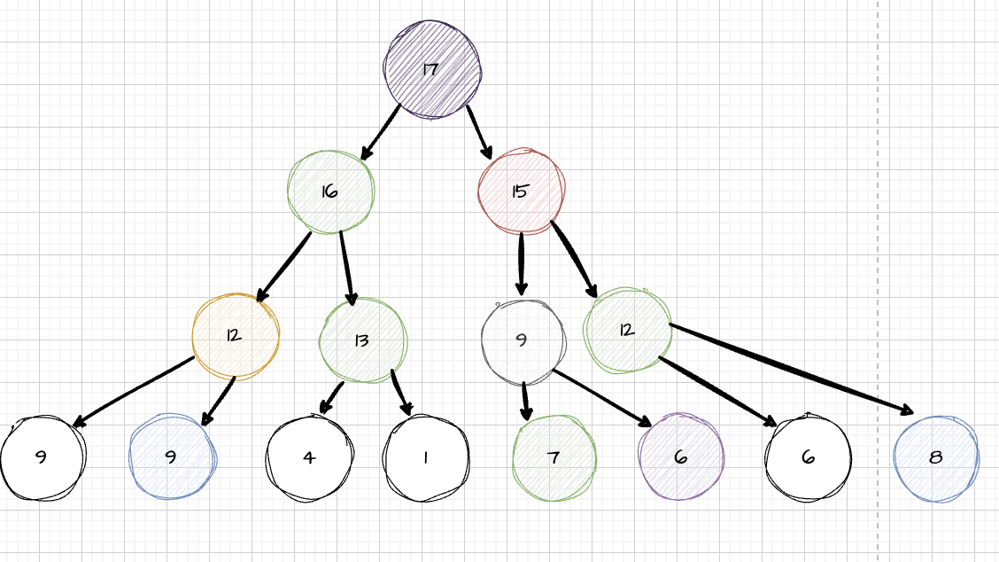

# Sorting Algorithms Part 2

In this section we will be looking at the following sorting algorithms which have the better performance then we have seen in the previous section.

<details>
  <summary> Merge Sort </summary>

# What is Merge Sort?

- Merge sort is a divide and conquer algorithm.
- It divides input array in two halves, calls itself for the two halves and then merges the two sorted halves.


## How does it work?

Let's take the example from the image above and see how merge sort works.

```text
arr = [ 3,8 ,1 ,9 ,4, 0, 5, 7]

Divid the array into two halves:
[ 3, 8, 1, 9 ] [ 4, 0, 5, 7 ]

Divid the array into two halves:
[ 3, 8 ] [ 1, 9 ] [ 4, 0 ] [ 5, 7 ]

Divid the array into two halves - Step 1:
[ 3 ] [ 8 ] [ 1 ] [ 9 ] [ 4 ] [ 0 ] [ 5 ] [ 7 ]

Merge the array - Step 2:
[ 3, 8 ] [ 1, 9 ] [ 0, 4 ] [ 5, 7 ]

Merge the array - Step 3:
[ 1, 3, 8, 9 ] [ 0, 4, 5, 7 ]

Merge the array - Step 4:
[ 0, 1, 3, 4, 5, 7, 8, 9 ]
```

From step 1 to step 2, we need to move pointer eight times, same as from step 2 to step 3 and from step 3 to step 4, so the complexity is `8*3 = 24`.

## Complexity

Let's take a dive into the complexity of merge sort.

```text
Step 1:
[ ] [ ] [ ] [ ] [ ] [ ] [ ] [ ]

Step 2:
[ ] [ ] [ ] [ ]

Step 3:
[ ][ ]

Step 4
[ ]
```

Length of an array = `8`, `8/2 = 4, 8/4 = 2, 8/8 = 1`, let's assume the length of an array is `n` and follow the same pattern, it would be like `n/2`, `n/4`, `n/8` and `1`, 1 = `n/2^k`, `2^k = n`, and `log2^n = k`(k means the total number of merging ), we have merged log2^n times, and each time we need to move pointer `n` times, so the complexity is `n*log2^n`, which is `O(nlogn)`.

```text
length = 8

8*log2^8 = 8*3 = 24(just like the graph below)
```


## Pseudocode

```text
// Part 1
merge(arr1, arr2):
  result = [], i = 0, j = 0
  while i < arr1.length && j < arr2.length:
    if arr1[i] > arr2[j]:
      add arr2[j] to result
      j++
    else:
      add arr1[i] to result
      i++

either arr1 or arr2 will have something left, pul all remaining elements to result by using loop.

// Part 2
mergeSort(arr):
  if arr.length = 1:
    return arr
  else:
    mid = arr.length/2
    left = arr.slice(0, middle)
    right = arr.slice(middle, arr.length)
    return merge(mergeSort(left), mergeSort(right))
```

**function mergeSort** is a **recursive function**, it will call itself until the length of array is 1, then it will return the array, and then it will merge the array.

**function merge** is a function that will merge two **sorted** arrays into one sorted array.

## Implementation

```ts
// Define merge function
// Need to pass sorted arrays
function merge(arr1: number[], arr2: number[]) {
  let result: number[] = [];
  let i = 0;
  let j = 0;

  while (i < arr1.length && j < arr2.length) {
    if (arr1[i] > arr2[j]) {
      result.push(arr2[j]);
      j++;
    } else {
      result.push(arr1[i]);
      i++;
    }
  }
  // Dealing with the left elements, loop them and add the to the arr
  while (i < arr1.length) {
    result.push(arr1[i]);
    i++;
  }
  while (j < arr2.length) {
    result.push(arr2[j]);
    j++;
  }
  return result;
}
// console.log(merge([1, 5, 9], [-3, 2, 7]));

function mergeSort(arr: number[]): number[] {
  if (arr.length <= 1) {
    return arr;
  } else {
    let middle = Math.floor(arr.length / 2);
    let left = arr.slice(0, middle);
    let right = arr.slice(middle, arr.length);
    return merge(mergeSort(left), mergeSort(right));
  }
}

console.log(mergeSort([13, 9, 10, 4, 7, 2, 11, 5, 19, 1]));

/**
 * Result
[
  1,  2,  4,  5,  7,
  9, 10, 11, 13, 19
]
 * 
*/
```

## Big O of Merge Sort

- Worse case: `O(nlogn)`
- Best case: `O(nlogn)`
- Average case: `O(nlogn)`

When using merge sort, we know that it has to divide the array into two havles and then merge them wherther the array is sorted or not, so the best case, worse case and average case are all the same.

Take a look at the code, when implementing merge sort, we have created several new arrays (left, right) and recursive calls, so the space complexity is `O(n)`.

### Resources

[Learn Merge Sort in 13 minutes](https://www.youtube.com/watch?v=3j0SWDX4AtU)
[Sort List - Merge Sort](https://www.youtube.com/watch?v=TGveA1oFhrc)

</details>

<details>
  <summary>Tree</summary>

# What is Tree?

Tree is a data structure that consists of nodes in a parent/child relationship.

- A tree should have only one root node.
- Another definition of tree is **"tree is acyclic"**, which means there is **no cycle** in the tree.


## Various types of trees

- Binary Tree

  - Each node can have **at most two** children.

  

- Complete Binary Tree

  - Every level of the tree is **filled** except for the last level.
  - The last level is filled from **left to right**.

  

- Full Binary Tree

  - All **leaf nodes** have the same depth.

  

- Max Heap

  - A **complete binary tree** where the largest node is always **at the root** for any sub-trees.

  

### Try to make this tree a max heap


Result should be:



## How to create a max heap?

Swap a node called `N` down, and keep swapping id the node `N` has a child node that is bigger than the node `N`.

</details>
