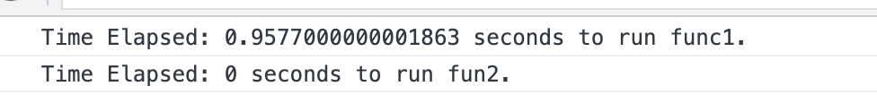

# Comparing Algorithms

Question: Why do we need to compare algorithms?

Below are examples of two different algorithms that solve the same problem. Which one is better?

```typescript
// See example1.ts
// function 1 example
const fun1 = (n: number) => {
  let sum = 0;
  for (let i = 1; i <= n; i++) {
    sum += i;
  }
  return sum;
};

console.log("function 1 result:", fun1(10));

// function 2 example
const fun2 = (n: number) => {
  return (n * (n + 1)) / 2;
};

console.log("function 2 result:", fun2(10));
```

When we think about which algorithm is better, we need to consider the following:
1. Time Complexity (Which one is faster?)
2. Space Complexity (Which one uses less memory?)

Now let's compare the two functions with window.performance.now().

```typescript
// function 1 example
const fun1 = (n: number) => {
  let sum = 0;
  for (let i = 1; i <= n; i++) {
    sum += i;
  }
  return sum;
};

// function 2 example
const fun2 = (n: number) => {
  return (n * (n + 1)) / 2;
};

// Use time.now() to measure the time
let t1 = window.performance.now();
fun1(100);
let t2 = window.performance.now();
console.log(`Time Elapsed: ${(t2 - t1) / 1000} seconds to run func1.`);

let t3 = window.performance.now();
fun2(100);
let t4 = window.performance.now();
console.log(`Time Elapsed: ${(t4 - t3) / 1000} seconds to run fun2.`);
```

Let's add an `index.html` file and run the code in the browser. Since browser does not recongnize typescript, we can run `tsc app.ts` to compile the code into javascript.

```html
<!DOCTYPE html>
<html lang="en">
  <head>
    <meta charset="UTF-8" />
    <title>Algorithms</title>
  </head>
  <body>
    <script src="./app.js"></script>
  </body>
</html>
``````



We can refresh browser to see the result is different, but in the most of time, fun2 is faster than fun1. So we can say fun2 is better than fun1, but wait a minute, why it got different result when we refresh the browser? Possible reason is that different computer has different CPU, so the result is different, so using time difference is not a good way to compare algorithms.
