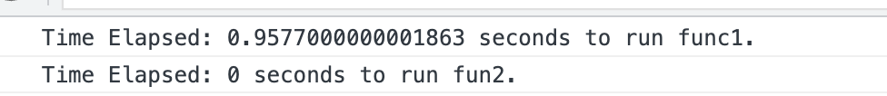

# Complexity and Big O

<details>
<summary>What is complexity?</summary>

There are two complexity we need to consider when we compare algorithms:
1. Time Complexity (Which one is faster?)
2. Space Complexity (Which one uses less memory?)

## How to measure complexity?

Generally, every `addition`, `subtraction`, `multiplication`, `division` and comparison (`<`, `>`, `<=`, `>=`, `==`, `!=`) is considered as `1 operation`.

Complexity means how many operations are required to complete the task.

We use funtion (`f(n)`) to represent the complexity of an algorithm. `n` is the size of the input.

```typescript
// example2.ts

function example(n: number) {
  let counter = 0;
  for (let i = 0; i < 3 * n; i++) {
    // console.log("Hello");
    counter++;
  }

  for (let i = 0; i < n; i++) {
    for (let j = 0; j < n; j++) {
      // console.log("Hello");
      counter++;
    }
  }
  // console.log("Hello");
  // console.log("Hello");
  // console.log("Hello");
  // console.log("Hello");
  counter += 4;

  return counter;
}

for (let i = 2; i < 10; i++) {
  console.log(`example${i} will print out ` + example(i) + " Hellos");
}
```

We can see that f(n) and n have a quadratic relationship.

;

```
n = 2, f(n) = 14
n = 3, f(n) = 22
n = 4, f(n) = 32
n = 5, f(n) = 44
n = 6, f(n) = 58
n = 7, f(n) = 74
n = 8, f(n) = 92
n = 9, f(n) = 112
.
.
.
n = 100, f(n) = 10304
```

As you can see, when increases number of n, the value of f(n) increases quadratically. Meaning that when we increase the size of the input, the number of operations increases quadratically.


## Back to example 
// example1.ts
```typescript
const fun1 = (n: number) => {
  let sum = 0;
  for (let i = 1; i <= n; i++) {
    sum += i;
  }
  return sum;
};

const fun2 = (n: number) => {
  return (n * (n + 1)) / 2;
};
```

What is the complexity of `fun1`? When we think about complexity, it usually means how many operations are required to complete the task, in `func1`, it has to do the following operations when execute the `for loop`:

1. `i <= n`
2. `i ++`
3. `sum += i`

So the complexity of `fun1` is `f(n) = 3n`.

What is the complexity of `fun2`? In `fun2`, it only has to do the following operations:

1. `n * `
2. `n + 1`
3. `/ 2`

But what makes it different from `fun1` is that it only has to do the operations once, no matter how big the input is, if `n === 100`, it would be `100 * 101 / 2`, if `n === 100000`, it would be `100000 * 100001 / 2`, so the complexity of `fun2` is `f(n) = 3`.

In conclusion, `fun1` is linear complexity, `fun2` is constant complexity, take a look at the following graph:

;

When the size of `n` is small, there's no major difference between `fun1` and `fun2`, but when the size of `n` is big, the difference is huge.

</details>

<details>

<summary>Comparing algorithms</summary>

## Question: Why do we need to compare algorithms?

Below are examples of two different algorithms that solve the same problem. Which one is better?

```typescript
// See example1.ts
// function 1 example
const fun1 = (n: number) => {
  let sum = 0;
  for (let i = 1; i <= n; i++) {
    sum += i;
  }
  return sum;
};

console.log("function 1 result:", fun1(10));

// function 2 example
const fun2 = (n: number) => {
  return (n * (n + 1)) / 2;
};

console.log("function 2 result:", fun2(10));
```

When we think about which algorithm is better, we need to consider the following:
1. Time Complexity (Which one is faster?)
2. Space Complexity (Which one uses less memory?)

Now let's compare the two functions with window.performance.now().

```typescript
// function 1 example
const fun1 = (n: number) => {
  let sum = 0;
  for (let i = 1; i <= n; i++) {
    sum += i;
  }
  return sum;
};

// function 2 example
const fun2 = (n: number) => {
  return (n * (n + 1)) / 2;
};

// Use time.now() to measure the time
let t1 = window.performance.now();
fun1(100);
let t2 = window.performance.now();
console.log(`Time Elapsed: ${(t2 - t1) / 1000} seconds to run func1.`);

let t3 = window.performance.now();
fun2(100);
let t4 = window.performance.now();
console.log(`Time Elapsed: ${(t4 - t3) / 1000} seconds to run fun2.`);
```

Let's add an `index.html` file and run the code in the browser. Since browser does not recongnize typescript, we can run `tsc app.ts` to compile the code into javascript.

```html
<!DOCTYPE html>
<html lang="en">
  <head>
    <meta charset="UTF-8" />
    <title>Algorithms</title>
  </head>
  <body>
    <script src="./app.js"></script>
  </body>
</html>
``````



We can refresh browser to see the result is different, but in the most of time, fun2 is faster than fun1. So we can say fun2 is better than fun1, but wait a minute, why it got different result when we refresh the browser? Possible reason is that different computer has different CPU, so the result is different, so using time difference is not a good way to compare algorithms.

</details>

<details>
<summary>Big O</summary>

## Big O notation

1. `Big O notation` is a tool that describe the limiting behavior of a function when the argument tends towards a particular value or infinity.

2. `Big O notation` usually considers the `worst-case` scenario of an algorithm.(i.e. the longest amount of time an algorithm can possibly take to complete)

## Calculating Big O
1. Constants don't matter.

- constants vs variables, i.e. `f(n) = 3n`, 3 is a constant, n is a variable, therefore what is its Big O? The Big O is `O(n)`, because constants don't matter, so we can remove the 3.

2. Smaller terms don't matter.
- i.e. `f(n) = 2n^2 + 3n + 4`, the Big O is `O(n^2)`, because the smaller terms don't matter, so we can remove the `2`(because the **constant doesn't matter**) and `4`, what about `3n`? Compare to `2n^2`, `3n` is a smaller term, so we can remove it as well.

3. Logarithm Base doesn't matter.
- i.e. `f(n) = log2(n)`, the Big O is `O(log(n))`, because the logarithm base(`2`) doesn't matter, so we can remove the base.

### What is the Big O of f(n) = 5 ?

You might think the answer is `O(5)`, but it's actually `O(1)`, when we say the constant doesn't matter, it doesn't mean we delete it, it only means that we make it `1`, i.e. `f(n) = 3n` is actually `f(n) = 1n`, so the answer of `f(n) = 5` is `f(n) = 1`, which is `O(1)`.

## Common Big O of Algorithms
- `O(1)`
- `O(log(n))`
- `O(n)`
- `O(nlog(n))`
- `O(n^2)`
- `O(n^3)`

The above list is in order of **efficiency**, `O(1)` is the most efficient, `O(n^3)` is the least efficient.

### Why constant doest not matter?

Here is an example:[Google sheet](https://docs.google.com/spreadsheets/d/1G-y3lX_oJlBGxRSPI2bdazgyh14ETyQML9TkjRi8SyM/edit?usp=sharing)

Take a look at the `n` and `n+1500`, when the input size gets bigger, it doesn't make the extreme difference compare with `n^2`,therefore we can just ignore the constant.

In conclusion, the worst case scenario in this example is `O(n^2)`.

</details>
