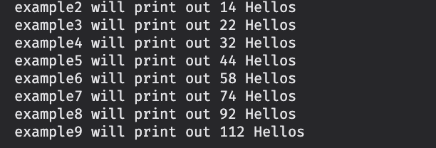
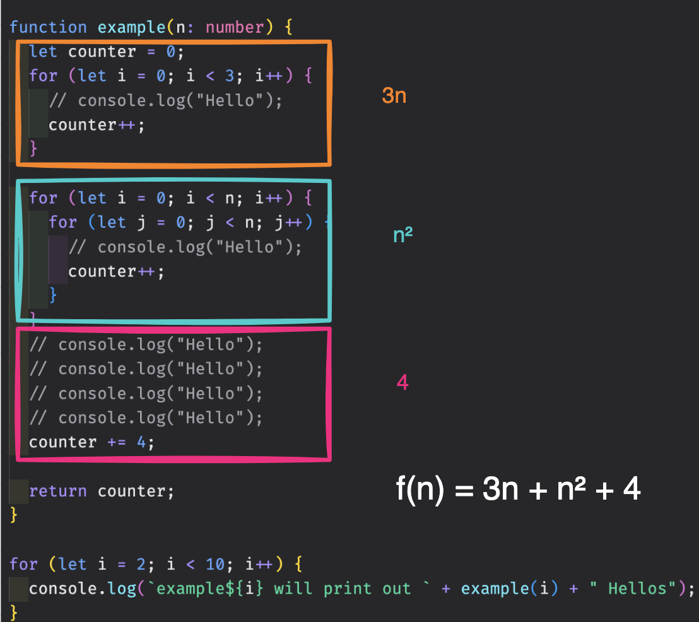
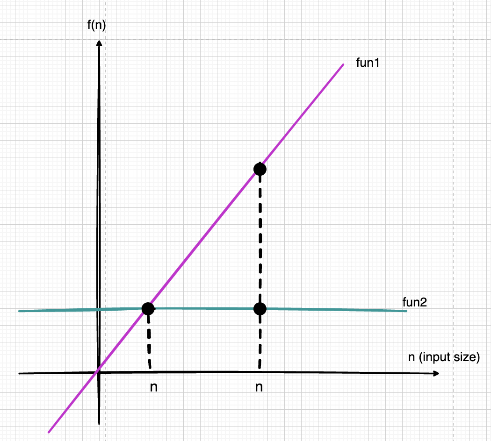

# What is complexity?

There are two complexity we need to consider when we compare algorithms:
1. Time Complexity (Which one is faster?)
2. Space Complexity (Which one uses less memory?)

## How to measure complexity?

Generally, every `addition`, `subtraction`, `multiplication`, `division` and comparison (`<`, `>`, `<=`, `>=`, `==`, `!=`) is considered as `1 operation`.

Complexity means how many operations are required to complete the task.

We use funtion (`f(n)`) to represent the complexity of an algorithm. `n` is the size of the input.

```typescript
// example2.ts

function example(n: number) {
  let counter = 0;
  for (let i = 0; i < 3 * n; i++) {
    // console.log("Hello");
    counter++;
  }

  for (let i = 0; i < n; i++) {
    for (let j = 0; j < n; j++) {
      // console.log("Hello");
      counter++;
    }
  }
  // console.log("Hello");
  // console.log("Hello");
  // console.log("Hello");
  // console.log("Hello");
  counter += 4;

  return counter;
}

for (let i = 2; i < 10; i++) {
  console.log(`example${i} will print out ` + example(i) + " Hellos");
}
```

We can see that f(n) and n have a quadratic relationship.

;

```
n = 2, f(n) = 14
n = 3, f(n) = 22
n = 4, f(n) = 32
n = 5, f(n) = 44
n = 6, f(n) = 58
n = 7, f(n) = 74
n = 8, f(n) = 92
n = 9, f(n) = 112
.
.
.
n = 100, f(n) = 10304
```

As you can see, when increases number of n, the value of f(n) increases quadratically. Meaning that when we increase the size of the input, the number of operations increases quadratically.



## Back to example 
// example1.ts
```typescript
const fun1 = (n: number) => {
  let sum = 0;
  for (let i = 1; i <= n; i++) {
    sum += i;
  }
  return sum;
};

const fun2 = (n: number) => {
  return (n * (n + 1)) / 2;
};
```

What is the complexity of `fun1`? When we think about complexity, it usually means how many operations are required to complete the task, in `func1`, it has to do the following operations when execute the `for loop`:

1. `i <= n`
2. `i ++`
3. `sum += i`

So the complexity of `fun1` is `f(n) = 3n`.

What is the complexity of `fun2`? In `fun2`, it only has to do the following operations:

1. `n * `
2. `n + 1`
3. `/ 2`

But what makes it different from `fun1` is that it only has to do the operations once, no matter how big the input is, if `n === 100`, it would be `100 * 101 / 2`, if `n === 100000`, it would be `100000 * 100001 / 2`, so the complexity of `fun2` is `f(n) = 3`.

In conclusion, `fun1` is linear complexity, `fun2` is constant complexity, take a look at the following graph:

;

When the size of `n` is small, there's no major difference between `fun1` and `fun2`, but when the size of `n` is big, the difference is huge.