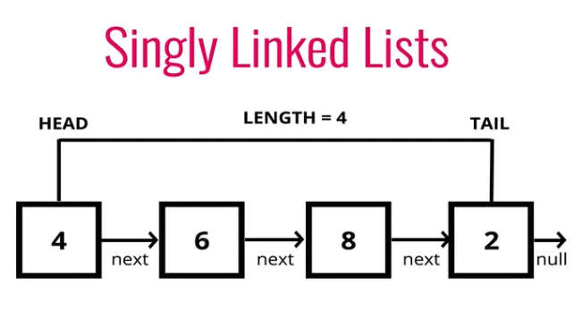
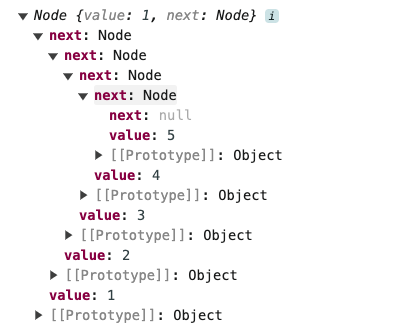
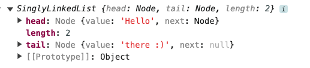
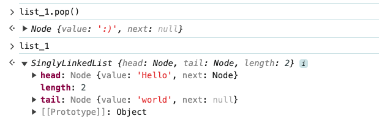

# Data Structure - Linked List

## Table of Contents

- [Quick Review of Classes](#quick-review-of-classes)
  - [Class Methods](#class-methods)
    - [`static` keyword](#static-keyword)
    - [`public` keywords](#public-keywords)
    - [`private` keyword](#private-keyword)
- [Singly Linked List](#singly-linked-list)
  - [Definition](#definition)
  - [Comparison with Arrays](#comparison-with-arrays)
  - [Example of a Node](#example-of-a-node)
  - [Adding a insertion method](#adding-a-insertion-method)
    - [Pushing Pseudocode](#pushing-pseudocode)
  - [Adding a removal method](#adding-a-removal-method)
    - [Popping Pseudocode](#popping-pseudocode)

## Prerequisite

- [ES2015-Classes](https://developer.mozilla.org/zh-TW/docs/Web/JavaScript/Reference/Classes)

<a id="quick-review-of-classes"></a>

## Quick Review of Classes

### what is class

- `class` is a syntactic sugar for the constructor function.

- It is a template for creating objects, in javaScript, class is built on `prototype`
- Class declaration have the **temporal dead zone** restriction as `let` or `const`, so you can't access the class before it's declared.
- There two ways to define a class,

  - **Class declaration**

  ```javascript
  class Rectangle {
    constructor(height, width) {
      this.height = height;
      this.width = width;
    }
  }
  ```

  - **Class expression**
    - Can be anonymous.
    - Can have a name.

  ```javascript
  const Rectangle = class {
    constructor(height, width) {
      this.height = height;
      this.width = width;
    }
  };
  ```

### What is constructor

- It is a method for creating and initializing an object created with a class.
- It can be only one constructor in a class.
- Can use `super` keyword to call the constructor of a parent class.

```javascript
class Rectangle {
  constructor(height, width) {
    this.height = height;
    this.width = width;
  }
}
```

### Class Methods

- Methods are functions that are defined inside the class definition.

```javascript
class Rectangle {
  constructor(height, width) {
    this.height = height;
    this.width = width;
  }

  getArea() {
    return this.height * this.width;
  }
}
```

#### `static` keyword

- `static` keyword defines a static method for a class.
- Static methods are called without instantiating their class and **cannot be called through a class instance**.

```javascript
class Student {
  constructor(firstName, lastName) {
    this.firstName = firstName;
    this.lastName = lastName;
  }
  getFullName() {
    return `${this.firstName} ${this.lastName}`;
  }

  static enrollStudents() {
    return "Enrolling students";
  }
}

let firstStudent = new Student("John", "Doe");
console.log(firstStudent.getFullName());
// John Doe

console.log(firstStudent.enrollStudents());
// TypeError: firstStudent.enrollStudents is not a function (static method can't be called through a class instance)

console.log(Student.enrollStudents());
// Enrolling students
```

#### `public` keywords

- `public` keyword is used to define a property or method that can be accessed from outside the class.

```javascript
class Rectangle {
  constructor(height, width) {
    this.height = height;
    this.width = width;
  }
  // public method
  getArea() {
    return this.height * this.width;
  }
}
```

#### `private` keyword

- `private` keyword is used to define a property or method that can't be accessed from outside the class.
- **NOTE:** `#` symbol was introduced in ES6 to define private methods and properties,

```javascript
class Rectangle {
  constructor(height, width) {
    this.height = height;
    this.width = width;
  }
  // private method
  #getArea() {
    return this.height * this.width;
  }
}
```

## Singly Linked List



Screenshot Reference: [Understanding Singly Linked Lists and Their Functions](https://javascript.plainenglish.io/understanding-singly-linked-lists-and-their-functions-ae8f2e53f92d)

### Definition

- A linked list is a DS that contains a **head**, **tail** and **length** property.
- It is consists of nodes, and each **node** has a **value** and a **pointer** to another node or **null**.
- The opposite of a singly linked list is a **doubly linked list** which has a pointer to the previous node.

### Comparison with Arrays

|           |              Linked List               |                  Array                  |
| :-------- | :------------------------------------: | :-------------------------------------: |
| Indexes   |               No indexes               |            Indexes in order             |
| Execution | Connected via node with a next pointer | Insertion and deletion can be expensive |
| Access    |      Random access isn't allowed       | Can quickly access at a specific index  |

> **NOTE** Use linked list if you need to do a lot of insertion and deletion.

---

### Example of a Node

```javascript
// Check example_node.js in the examples folder

class Node {
  constructor(val) {
    this.val = val;
    this.next = null;
  }
}

let first = new Node(1);
first.next = new Node(2);
first.next.next = new Node(3);
first.next.next.next = new Node(4);
first.next.next.next.next = new Node(5);

console.log(first);
```

- `this.val` is the value of the node.
- `this.next` is the pointer to the next node.
- `let first = new Node(1);` creates a node with a value of 1.
- `first.next = new Node(2);` creates a node with a value of 2 and points to the next node and so on.



---

### Adding a insertion method

`push()` method is used to do insertion, when we want to do insertion in a linked list, we need to make sure the `head` and `tail` are updated.

Let's say I want to add number 6 to the empty linked list, here is the step by step process,

- Create a new node with a value of 6. (`new Node(6)`)
- If there is no head, set the head and tail to the new node. (`head = new Node(6) and tail = new Node(6)`)

Now we want to insert number 7 to the linked list,

- Create a new node with a value of 7. (`new Node(7)`)
- Set the next property of the tail to the new node.(`tail.next = new Node(7)`)
- Set the tail to the new node. (`tail = new Node(7)`)

#### Pushing Pseudocode

- This function should accept a value.
- Create a new node using the value passed to the function.
- If there is no head property on the list, set the head and tail to be the newly created node.
- Otherwise, set the next property on the tail to be that node and set the tail property on the list to be the newly created node.
- Increment the length by one.
- Return the linked list.

```javascript
// Check singly_linked_list_push.js in the examples folder

class Node {
  constructor(value) {
    this.value = value;
    this.next = null;
  }
}

class SinglyLinkedList {
  constructor() {
    this.head = null;
    this.tail = null;
    this.length = 0;
  }
  push(val) {
    const newNode = new Node(val);

    if (!this.head) {
      this.head = newNode;
      this.tail = this.head;
    } else {
      this.tail.next = newNode;
      this.tail = newNode;
    }

    this.length++;
    return this;
  }
}

let list_1 = new SinglyLinkedList();

list_1.push("Hello");
list_1.push("there :)");

console.log(list_1);
```



---

### Adding a removal method

Before we remove a node, we need to traverse the linked list to find the node we want to remove.

#### Popping Pseudocode

- If there're no nodes in the list, return undefined.
- Loop through the list until you reach the tail.
  - We need to declare two variables, `current` and `newTail`.
    - Set `current` to be the head of the list.
    - Set `newTail` to be the current node.
- Set the next property of the 2nd to last node to be null.
- Set the tail to be the 2nd to last node.
- Decrement the length of the list by 1.
- Return the value of the node removed.

```javascript
// Check singly_linked_list_pop.js in the examples folder

class SinglyLinkedList {
  constructor() {
    this.head = null;
    this.tail = null;
    this.length = 0;
  }
  push(val) {
    ...
  }
  pop() {
    if(!this.head) {
      return undefined;
    }
    let current = this.head;
    let newTail = current;
    while(current.next) {
      current = newTail;
      current = current.next;
    }
    this.tail = newTail;
    this.tail.next = null;
    this.length--;
    return current;
  }
}
```



### Shifting

Removing a new node from the beginning of the linked list.

#### Review of shift() and unshift()

- `shift()`: To **remove the fist item** in an array and **return the removed element.**

```javascript
const arr = [1, 2, 3, 4, 5];
const shiftedEle = arr.shift();

console.log("arr", arr); // [2, 3, 4, 5]
console.log("shiftedEle", shiftedEle); // 1 => number
```

- `unshift()`: To **add elements** at the beginning of an array and return the **new length of the array**.

```javascript
const arr = [1, 2, 3];

const newArr = arr.unshift(4, 5);

console.log(newArr); // 5

console.log(arr); // [4, 5, 1, 2, 3]
```

#### Shifting Pseudocode

- If there are no nodes, return undefined.
- Store the current head property in a variable.
- Set the head property to be the current head's next property.
- Decrement the length by 1.
- Return the value of the node removed.
