# Introduction to Algorithm Design

This chapter is about the introduction to algorithm design.

<details>
<summary>Linear Search(Sequential Search)</summary>

# Linear Seacch Description

An algorithm that sequentially **iterates** each element of the list **from left to right** **until a match is found or the whole list has been searched**.

## Pseudocode

This is a for loop, we loop through the array and check if the number of `[i]` from the array is equal to `n`, if it is, we return 1, if not, we return `-1`.

```
LINEARN-SEARCH(array, n):
    for i from 0 to array.length - 1:
        if (array[i] == n):
          return i;
    return -1;
```

## Overview of Linear Search

- Worst-case performance: O(n).
  - The target that we are looking for in the array is at the end of the array.
- Best-case performance: O(1).
  - The target that we are looking for in the array is at the beginning of the array.
- Average performance: O(n/2).
  - Means that you need to at least search half of the array to find the target.

[Linear Search - CS50 Shorts](https://www.youtube.com/watch?v=TwsgCHYmbbA)

</details>

<details>
<summary>Binary Search</summary>

# Binary Search Description

An algorithm that finds the position of a target value within a **sorted array**.

More efficient than linear search, but **ONLY** works on sorted arrays.

## Pseudocode

```
binarySearch(arr, n)
   min = 0
   max = arr.length - 1
   while (min <= max) / 2
         middle = (min + max) / 2
         if (n > arr[middle]):
             min = mid + 1
         else if (n < arr[middle]):
             max = middle - 1
         else:
               return middle
   return -1
```

## Example

```typescript
let numOfArr: number[] = [
  9, 12, 15, 18, 19, 20, 22, 25, 26, 26, 33, 37, 38, 41, 47, 47, 50, 55, 57, 60,
  68, 80, 87, 90, 98, 100, 103, 108, 109, 109, 116, 120, 120, 124, 127, 128,
  131, 135, 135, 139, 143, 145, 151, 155, 156, 158, 163, 164, 165, 169, 169,
  173, 174, 176, 177, 178, 181, 182, 182, 183, 184, 189, 192, 195, 200, 201,
  203, 204, 207, 213, 217, 222, 222, 222, 227, 228, 233, 235, 237, 239, 239,
  243, 248, 251, 252, 257, 260, 260, 263, 268, 270, 271, 271, 276, 281, 284,
  285, 295, 297, 298,
];

function binarySearch(arr: number[], n: number) {
  let min = 0;
  let max = arr.length - 1;
  let step = 0;

  while (min <= max) {
    // step++;
    let middle = Math.floor((max + min) / 2);
    if (n > arr[middle]) {
      min = middle + 1;
    } else if (n < arr[middle]) {
      max = middle - 1;
    } else if (n === arr[middle]) {
      console.log("Found number " + n + " at position " + middle);
      console.log("Found it after " + step + " steps.");
      return middle;
    }
  }

  console.log("Cannot find number " + n);
  return -1;
}

binarySearch(numOfArr, 213);
```

After running the code, here is the result:

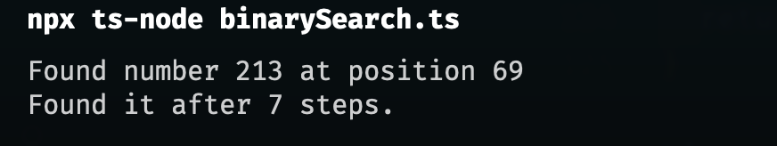

## Explaination

You can try to run code with different numbers, and you will find that the number of steps is at most 6 to 7 steps in this case.

Here is the graph to help us understand the time complexity of binary search:

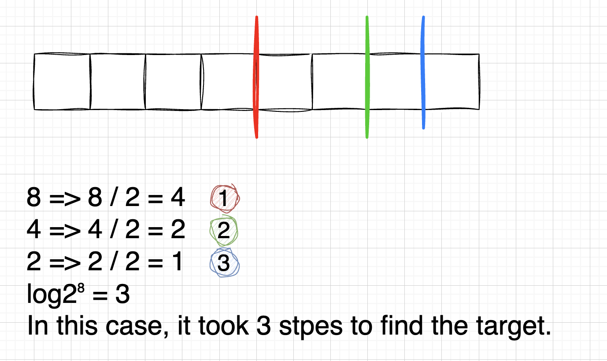

Let assume that the length of the array is `n`, then the result would be:

```
n => n/2 => n/4 => n/8 ... => 1
log2ⁿ (O(log2ⁿ) => O(log n))
```

## Overview of Binary Search

- Worst-case performance: O(log n).
  - If the target is at the end of the array.
- Best-case performance: O(1).
  - If the target is at the beginning of the array.
- Average performance: O(log n).
  - Means that you need to at least search half of the array to find the target.

## Resources

[Introduction to Binary Search by CS Dojo](https://www.youtube.com/watch?v=6ysjqCUv3K4)

</details>

<details>
  <summary>Intersaction Problems</summary>

# Intersaction Problems

Let's say we want to find the intersaction of two arrays, i.e. arr1 is `[1, 2, 3, 4, 5]` and arr2 is `[2, 4, 6, 8, 10]`, then the intersaction of arr1 and arr2 is `[2, 4]`, usually we would compare each element of arr1 with each element of arr2, and if they are the same, we would push the element into a new array, and return the new array.

```typescript
function findIntersaction(arr1: number[], arr2: number[]) {
  let result = [];
  for (let i = 0; i <= arr1.length; i++) {
    for (let j = 0; j <= arr2.length; j++) {
      console.log(arr1[i], arr2[j]);
      if (arr1[i] === arr2[i]) {
        result.push(arr1[i]);
      }
    }
  }
  console.log(result);
  return result;
}

findIntersaction([1, 2, 3, 4, 5], [3, 4, 5, 6, 7]);
```

The result would be:

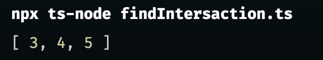

But let's dive into this function and see how many steps it takes to find the intersaction of two arrays.

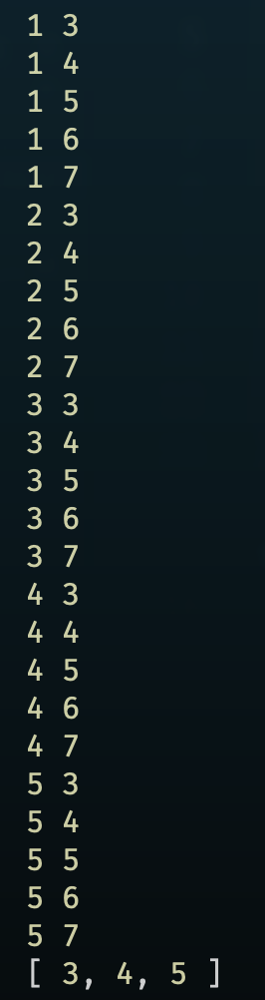

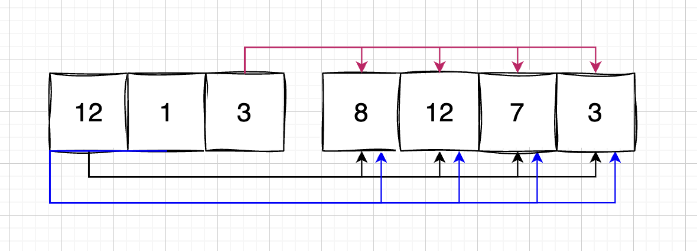

As you can see we need to compare each element of arr1 with each element of arr2, so the time complexity of this function is `O(n^2)` which is not good.

## Counter

"counter" is a variable that is used to count something, e.g. the number of times a loop iterates which we will be using this concept to solve the intersaction problem.

```typescript
//counter.ts

function counter(arr1: number[], arr2: number[]) {
  let result: number[] = [];
  let counter: { [key: number]: number } = {};
  // Concantenate the two arrays
  let arr3: number[] = arr1.concat(arr2);

  // loop through the array and count the number of times each element appears
  for (let i = 0; i < arr3.length; i++) {
    // If the element is not in the counter object, add it and set the value to 1
    if (!counter[arr3[i]]) {
      counter[arr3[i]] = 1;
    }
    // If the element is already in the counter object, increment the value by 1
    counter[arr3[i]]++;
  }
  console.log(counter);

  // loop through the counter object and push the elements that appear more than once into the result array
  for (let property in counter) {
    if (counter[property] >= 3) {
      result.push(parseInt(property));
    }
  }
  console.log(result);
}

counter([1, 2, 3, 4, 5], [3, 4, 5, 6, 7]);
```

first `console.log(counter)` shows that the counter object is:

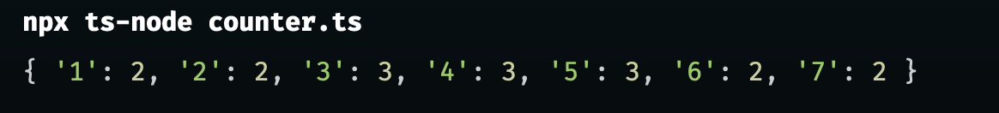

We can see that only `3`, `4`, and `5` appear more than others, so we push them into the result array.

Second `console.log(result)` shows that the result array is:

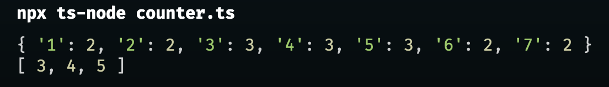

## Complexity of using counter

- Time complexity: `O(n+m)` (`O(n)`).
  - We only need to loop through the array once.
  </details>

<details>
  <summary>Coding Practice 1: Frequency Problem</summary>

# Coding Practice 1: Frequency Problem

Given two strings `abba` and `bbaa`, write a function that returns `true` if the two strings have the same frequency of characters, and `false` otherwise.

```typescript
// frequency.ts

type Counter = { [key: string]: number };

function checkFrequency(str1: string, str2: string) {
  // make them arrays
  let arr1 = str1.split("");
  let arr2 = str2.split("");

  // Check if they are the same length
  if (arr1.length !== arr2.length) return false;

  // Create two counter objects
  let counter1: Counter = {};
  let counter2: Counter = {};

  // Loop through the first array and count the number of times each element appears

  for (let i = 0; i < arr1.length; i++) {
    if (counter1[arr1[i]]) {
      counter1[arr1[i]]++;
    } else {
      counter1[arr1[i]] = 1;
    }
  }

  for (let j = 0; j < arr2.length; j++) {
    if (counter2[arr2[j]]) {
      counter2[arr2[j]]++;
    } else {
      counter2[arr2[j]] = 1;
    }
  }

  // console.log("counter1",counter1);
  // console.log("counter2",counter2);

  // Check value in counter
  for (let property in counter1) {
    if (!counter1[property]) return false;

    if (counter2[property] !== counter1[property]) return false;

    return true;
  }
}

console.log("Result of checking:", checkFrequency("abba", "aabb"));
```

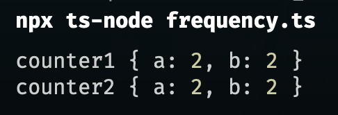

Result:

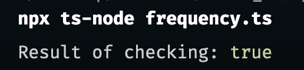

</details>

<details>
<summary>Coidng Practice 2: Average Pair</summary>

# Coding Practice 2: Average Pair

Given a sorted array of integers and a target average, determine if there is a pair of values in the array where the average of the pair equals the target average. There may be more than one pair that matches the average target.

Let's try to write down the solution that came across our mind first, ignore the time complexity for now.

```typescript
// averagePair.ts

function averagePair(arr: number[], avg: number) {
  let result: number[] = [];
  // loop through the array
  for (let i = 0; i < arr.length - 1; i++) {
    // loop through the array again
    for (let j = i + 1; j < arr.length; j++) {
      // check if the average of the two numbers is equal to the avg
      if ((arr[i] + arr[j]) / 2 === avg) {
        result.push(arr[i], arr[j]);
      }
    }
  }
  console.log("Checking average pari result:", result);
  return result;
}

averagePair([-11, 0, 1, 2, 3, 5, 8, 20], 1.5);
```

Here is the result:

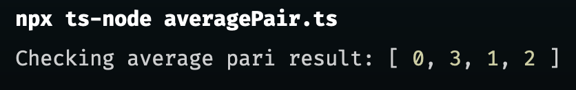

</details>

<details>
  <summary> Pointer </summary>

# Pointer

A pointer is a variable that stores the memory address of another variable.

Take the example of the average pair problem, the complexity was O(n^2) which was not good, let's implement the solution with pointers to see if we can improve the time complexity.

```typescript
// pointer.ts

function pointer(arr: number[], avg: number) {
  // create right and left pointer and an empty array

  let result: number[] = [];
  let leftPointer = 0;
  let rightPointer = arr.length - 1;

  while (rightPointer > leftPointer) {
    // create a temporary avg
    let tempoAvg = (arr[rightPointer] + arr[leftPointer]) / 2;

    if (tempoAvg > avg) {
      rightPointer--;
    } else if (tempoAvg < avg) {
      leftPointer++;
    } else if (tempoAvg === avg) {
      result.push(arr[leftPointer], arr[rightPointer]);
      rightPointer--;
      leftPointer++;
    }
  }
  console.log("Result of average pair", result);
  return result;
}

pointer([-11, 0, 1, 2, 3, 5, 8, 20], 1.5);
```

Here is the result:

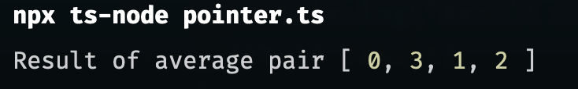

With implementation of pointers, the time complexity is O(n) which is much better than O(n^2).

Here is the graph to help us understand the time complexity of pointers:

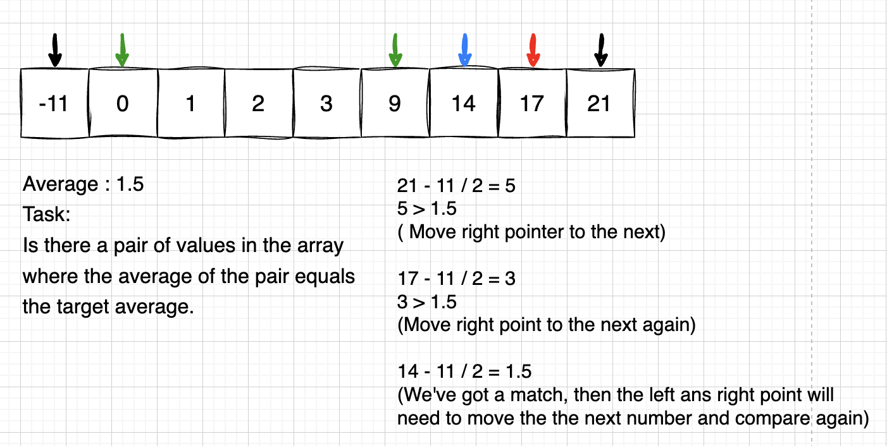

We move the right pointer to the next if there's no matched, once there's a matched. move both pointers to the next.

</details>

<details>
<summary>Coding practice 3 : Palindrome</summary>

# Coding practice 3 : Palindrome

Palindrome means that a word, phrase, or sequence that reads the same backward as forward, e.g. `madam`, `racecar`.

Let's try to write a function that checks if a string is a palindrome.

```typescript
// palindrome.ts

function checkIsPalindrome(str: string) {
  let rightPointer = str.length - 1;
  let leftPointer = 0;

  while (leftPointer <= rightPointer) {
    if (str[leftPointer] === str[rightPointer]) {
      leftPointer++;
      rightPointer--;
    } else {
      console.log(`${str} is not a palindrome`, false);
      return false;
    }
    console.log(`${str} is a palindrome`, true);
    return true;
  }
}

checkIsPalindrome("tacocat");
checkIsPalindrome("tenet");
checkIsPalindrome("absolute");
```

The result is:

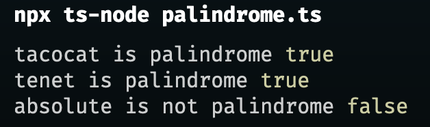

</details>

<details>
  <summary> Coding Practice 4 : Subsequence </summary>

# Coding Practice 4 : Subsequence

## What is a subsequence?

A subsequence is a sequence that can be derived from another sequence by deleting some or no elements without changing the order of the remaining elements.

## Example

`abc`, `abg`, `bdf`, `aeg`, `acefg` ... are subsequences of `abcdefg`.

Let's try to write a function to check if a string is a subsequence of another string by using pointers.

```typescript
function checkIsSubsequence(str1: string, str2: string) {
  // There' no point to execute when the length of string 1 is 0
  if (str1.length === 0) return true;

  let pointer1 = 0;
  let pointer2 = 0;

  while (pointer2 <= str2.length) {
    if (str1[pointer1] === str2[pointer2]) {
      pointer1++;
    }
    if (pointer1 >= str1.length) {
      console.log("Result is:", true);
      return true;
    }
    pointer2++;
  }
  console.log("Result is:", false);
  return false;
}

checkIsSubsequence("book", "brooklyn");
checkIsSubsequence("abbbbc", "bbbac");
```


</details>

<details>
<summary> Sliding Window </summary>

# What is sliding window?

Sliding window is a technique that is used to solve problems that involve a set of consecutive elements in an array or a string.

For example: we have an array of [2, 3, 9, 10, 11], it's like sub-listed and runs over the underlying collection.

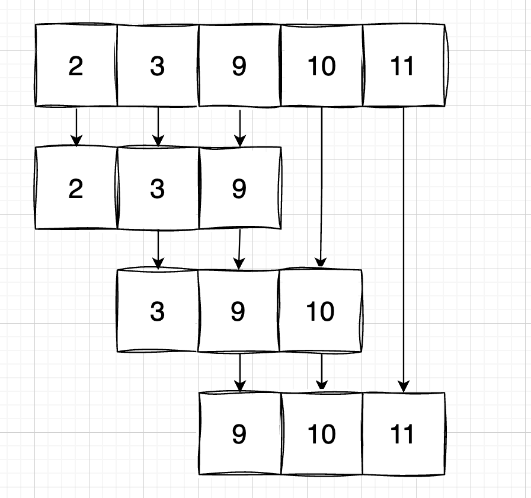s

</details>

<details>
<summary> Coding Practice 5 : Sliding window </summary>

## Coding Practice 5 : Max sum

In this coding practice, we are going to find the max sum from a subarray of a given array by applying sliding window technique.

Here are arrays and the size is 3, we need to find the max sum every 3 numbers without duplicates.

`[2, 7, 3, 0, 6, 1, -5, -12, -11]`

`2` would be our start point, and our end point would be `5`, but how to find the index of `5`? Take a look at the graph below:

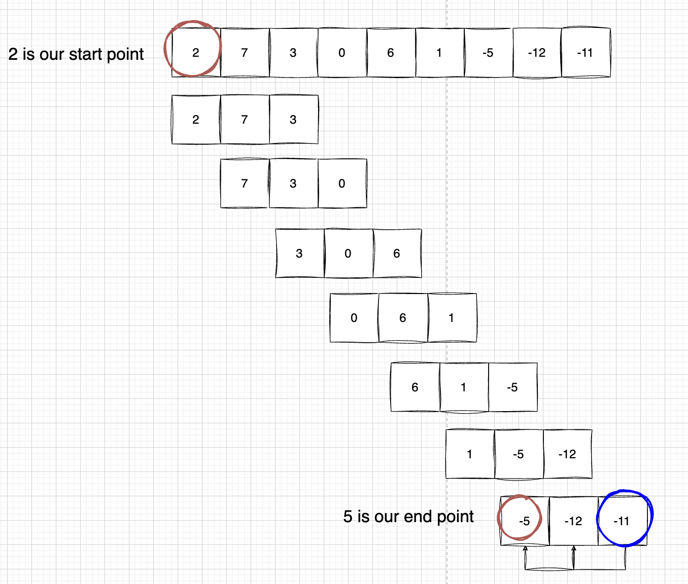

We can check the last number from the array which is `-11`, the index of `-11` is `arr.length - 1`, the since the size is `3`, we need to push forward 2 times, therefore the index of `5` is `arr.length - 1 - (n - 1)`, `n` refers to the size `3`.

> `arr.length - 1 - (n - 1)` = `arr.length - n`

```typescript
// sildingWindow.ts
function maxSum(arr: number[], size: number) {
  let maxSum = -infinity;

  if (size > arr.length) return null;

  for (let i = 0; i <= arr.length - size; i++) {
    for (let j = i; j < i + size; j++) {
      console.log(i, j);
    }
  }
}

maxSum([2, 7, 3, 0, 6, 1, -5, -12, -11], 2);
```

Here we declare a function called `maxSum` ans pass the argument of an number of array and an argument of number of size.

First we declare a variable called `maxSum` and set it to `-infinity` which is the smallest number in JavaScript.

Then we check if the size is greater than the length of the array, if it is, we return `null`.

Then we loop through the array and check start index.

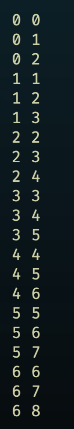

Here I have grouped them to make it easier to understand.

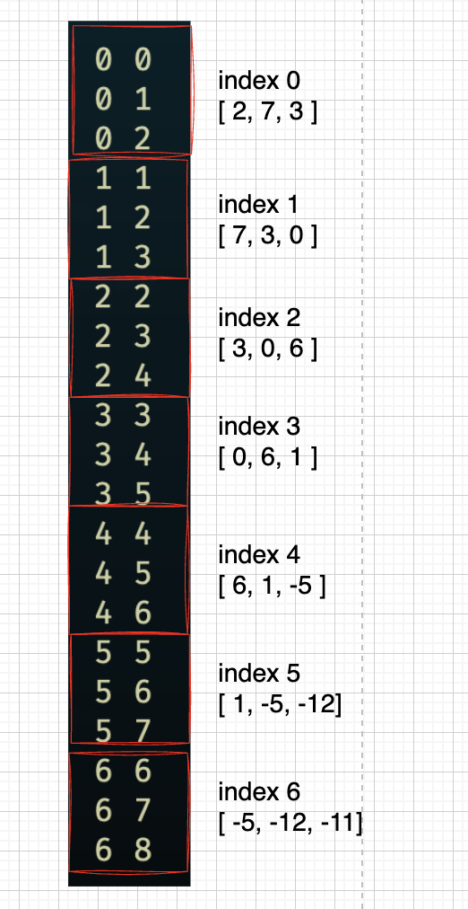

Now let's find max sum from the array.

```typescript
// sildingWindow.ts
function maxSum(arr: number[], size: number) {
  let max_value = -Infinity;

  if (size > arr.length) {
    return null;
  }

  for (let i = 0; i <= arr.length - size; i++) {
    let attempt = 0;
    for (let j = i; j < i + size; j++) {
      attempt += arr[j];
    }
    if (attempt > max_value) {
      max_value = attempt;
    }
  }

  console.log(max_value);
  return max_value;
}

maxSum([2, 7, 3, 0, 6, 1, -5, -12, -11], 3); // 12
```

As we all know, the time complexity of this function is `O(n^2)`, which is not good, let's try to improve it.

```ts
function maxSumImproved(arr: number[], size: number) {
  if (size > arr.length) return null;

  // calculate the value of first group [2, 7, 3]
  let maxValue = 0;
  for (let i = 0; i < size; i++) {
    maxValue += arr[i];
  }

  let tempValue = maxValue;
  for (let j = size; j < arr.length; j++) {
    //console.log("j", j); // index of the rest of number
    tempValue = maxValue + arr[j] - arr[j - size];
    if (tempValue > maxValue) maxValue = tempValue;
  }
  return maxValue;
}
maxSumImproved([2, 7, 3, 0, 6, 1, -5, -12, -11], 3);
```

</details>
